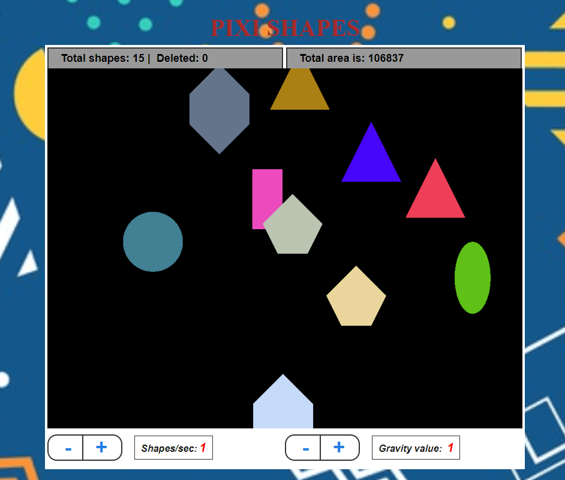

<div align="center">
  
  <h1>SHAPES GAME</h1>
  <p>
    The game generate random shapes with random colors. The shapes fall down from top to bottom.
  </p>
</div>

## Project Structure:

* `src/index.html` - main app HTML
* `src/assets/scss` - put custom app SCSS styles here. Don't forget to import them in `main.js`
* `src/assets/css` - the same as above but CSS here. Don't forget to import them in `main.js`
* `src/assets/img` - put images here. Don't forget to use correct path: `assets/img/some.jpg`
* `src/js` - put custom app scripts here
* `src/main.js` - main app file where you include/import all required libs and init app
* `src/components` - folder with custom `.vue` components
* `src/store` - app store for vue
* `static/` - folder with extra static assets that will be copied into output folder

## Game Setup:

``` bash
# Download repository:
git clone https://github.com/alex-vasylyev/Shapes

# Install dependencies:
npm install

# Server with hot reload at http://localhost:8081/
npm run dev

# Output will be at dist/ folder
npm run build
```

<div align="center">
  <h2>Game Manual:</h2>
</div>

#### Top side:
* `Total shapes field:` - shows the total number of the created shapes;
* `Total area field:` shows the surface area occupied by the shapes;

#### Game field:
The game generate random shapes with random colors. The shapes fall down from top to bottom.

#### Bottom side:
* `Number of shapes per second` - control button that increases/decreases the number of generated shapes per second.

* `Gravity Value` - control button that increases/decreases the gravity.

#### Interaction

* `Double click inside the game field` - A random shape with a random size and color will be generated at mouse position and start falling.

* `Click a shape` - The clicked shape disappears. It will also change the color of all shapes with the same type.

